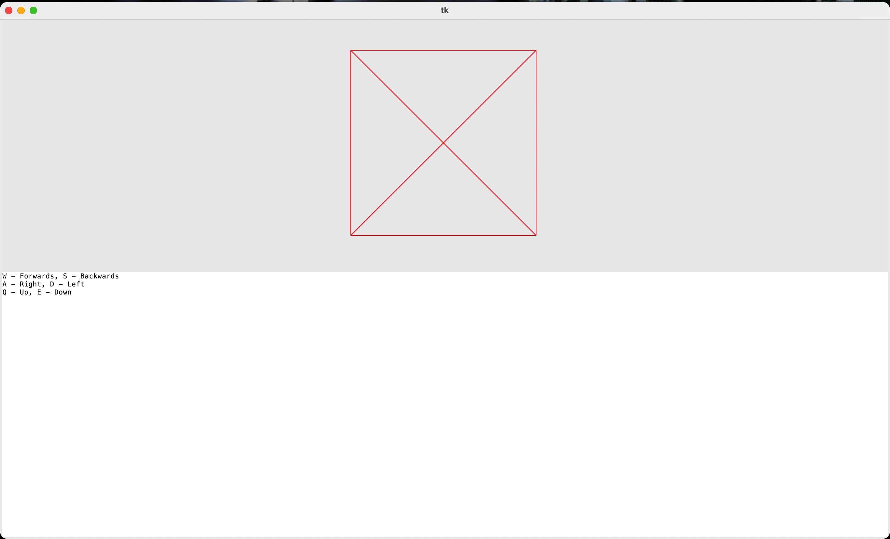

# Open Source Raytracer and Perspective Renderer Suite

This project seeks to make a open-source bare-bones 3D rendering engine for people interested in simple rendering. It contains two files, one for the perspective renderer and the raytracer.

## Features

- TKinter canvas and window for display
- Custom physics engine built off numpy
- Basic Wireframe perspective renderer

## Authors

- [@zacharypotishko](https://www.github.com/ZackPot)

## License

[MIT](https://choosealicense.com/licenses/mit/)

## Acknowledgements

 - [Readme.so](https://readme.so/)
 - Numpy

## Demo

## Usage
To use the perspective renderer, you can adjust the viewing point and the target position of the camera. You can also adjust the vertices of the shape variable. Please do not change any of the variable names, or else it might crash.

For the Raytracer, you must create an face objects then put them in a list to then out in a shape object. To adjust the camera, youc an adjust the origin and target_pos, but do not change any variables, only function settings. To make a light, use a light object. To render, use the render method of the Camera class.